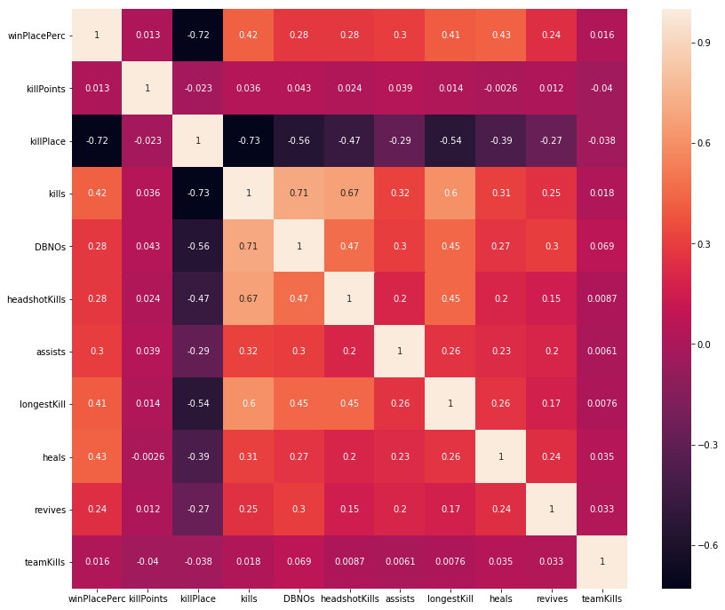
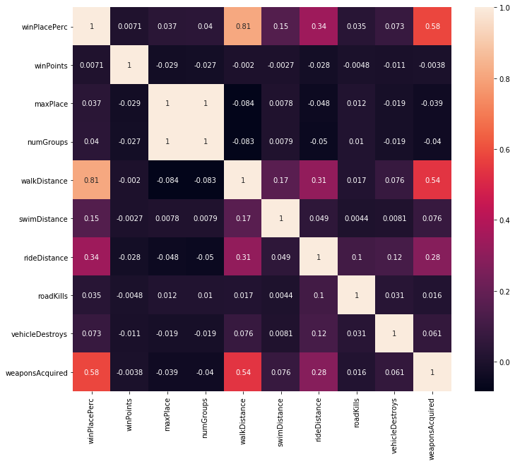

Requirements <br>
pandas,numpy,matplotlib,seaborn<br>

Using data from https://pubgtracker.com/ to analyse best strategies to play PUBG <br>

From the first heat map we can conclude that:<br>
<br>
Most fighting features seem to matter<br>
killPoints (Kill Rating for Ingame Statistic/Leaderboard) are not that important<br>
teamKills are friendly fire kills<br>
killPlace is the most Important feature so far<br>
<br>
From the second Heatmap we can see that<br>
<br>
walkDistance seems very important, which makes sense: you can only walk around if you are still alive!<br>
Same for swim and rideDistance but not that important <br>
winPoints you gain are not that much connected to your actual surviving time<br>
<br>
<br>
So the conclusion from this analysis is<br>

To survive longer in PUBG, you should be able to fight well, but also acquire many weapons.<br>
In general walking should be the preferred way to move.
<br>
Even noobs know this :)
<br>

```python
import numpy as np
import pandas as pd
import matplotlib.pyplot as plt
import os
```


```python
print(os.listdir(os.getcwd()+'\\pubgstats'))
```

    ['sample_submission_V2.csv', 'test_V2.csv', 'train_V2.csv']
    


```python
train = pd.read_csv(os.getcwd()+'\\pubgstats'+'\\train_V2.csv')
```


```python
train
```


<div>
<style scoped>
    .dataframe tbody tr th:only-of-type {
        vertical-align: middle;
    }

    .dataframe tbody tr th {
        vertical-align: top;
    }

    .dataframe thead th {
        text-align: right;
    }
</style>
<table border="1" class="dataframe">
  <thead>
    <tr style="text-align: right;">
      <th></th>
      <th>Id</th>
      <th>groupId</th>
      <th>matchId</th>
      <th>assists</th>
      <th>boosts</th>
      <th>damageDealt</th>
      <th>DBNOs</th>
      <th>headshotKills</th>
      <th>heals</th>
      <th>killPlace</th>
      <th>...</th>
      <th>revives</th>
      <th>rideDistance</th>
      <th>roadKills</th>
      <th>swimDistance</th>
      <th>teamKills</th>
      <th>vehicleDestroys</th>
      <th>walkDistance</th>
      <th>weaponsAcquired</th>
      <th>winPoints</th>
      <th>winPlacePerc</th>
    </tr>
  </thead>
  <tbody>
    <tr>
      <th>0</th>
      <td>7f96b2f878858a</td>
      <td>4d4b580de459be</td>
      <td>a10357fd1a4a91</td>
      <td>0</td>
      <td>0</td>
      <td>0.000</td>
      <td>0</td>
      <td>0</td>
      <td>0</td>
      <td>60</td>
      <td>...</td>
      <td>0</td>
      <td>0.0000</td>
      <td>0</td>
      <td>0.000</td>
      <td>0</td>
      <td>0</td>
      <td>244.80</td>
      <td>1</td>
      <td>1466</td>
      <td>0.4444</td>
    </tr>
    <tr>
      <th>1</th>
      <td>eef90569b9d03c</td>
      <td>684d5656442f9e</td>
      <td>aeb375fc57110c</td>
      <td>0</td>
      <td>0</td>
      <td>91.470</td>
      <td>0</td>
      <td>0</td>
      <td>0</td>
      <td>57</td>
      <td>...</td>
      <td>0</td>
      <td>0.0045</td>
      <td>0</td>
      <td>11.040</td>
      <td>0</td>
      <td>0</td>
      <td>1434.00</td>
      <td>5</td>
      <td>0</td>
      <td>0.6400</td>
    </tr>
    <tr>
      <th>2</th>
      <td>1eaf90ac73de72</td>
      <td>6a4a42c3245a74</td>
      <td>110163d8bb94ae</td>
      <td>1</td>
      <td>0</td>
      <td>68.000</td>
      <td>0</td>
      <td>0</td>
      <td>0</td>
      <td>47</td>
      <td>...</td>
      <td>0</td>
      <td>0.0000</td>
      <td>0</td>
      <td>0.000</td>
      <td>0</td>
      <td>0</td>
      <td>161.80</td>
      <td>2</td>
      <td>0</td>
      <td>0.7755</td>
    </tr>
    <tr>
      <th>3</th>
      <td>4616d365dd2853</td>
      <td>a930a9c79cd721</td>
      <td>f1f1f4ef412d7e</td>
      <td>0</td>
      <td>0</td>
      <td>32.900</td>
      <td>0</td>
      <td>0</td>
      <td>0</td>
      <td>75</td>
      <td>...</td>
      <td>0</td>
      <td>0.0000</td>
      <td>0</td>
      <td>0.000</td>
      <td>0</td>
      <td>0</td>
      <td>202.70</td>
      <td>3</td>
      <td>0</td>
      <td>0.1667</td>
    </tr>
    <tr>
      <th>4</th>
      <td>315c96c26c9aac</td>
      <td>de04010b3458dd</td>
      <td>6dc8ff871e21e6</td>
      <td>0</td>
      <td>0</td>
      <td>100.000</td>
      <td>0</td>
      <td>0</td>
      <td>0</td>
      <td>45</td>
      <td>...</td>
      <td>0</td>
      <td>0.0000</td>
      <td>0</td>
      <td>0.000</td>
      <td>0</td>
      <td>0</td>
      <td>49.75</td>
      <td>2</td>
      <td>0</td>
      <td>0.1875</td>
    </tr>
    <tr>
      <th>5</th>
      <td>ff79c12f326506</td>
      <td>289a6836a88d27</td>
      <td>bac52627a12114</td>
      <td>0</td>
      <td>0</td>
      <td>100.000</td>
      <td>1</td>
      <td>1</td>
      <td>0</td>
      <td>44</td>
      <td>...</td>
      <td>0</td>
      <td>0.0000</td>
      <td>0</td>
      <td>0.000</td>
      <td>0</td>
      <td>0</td>
      <td>34.70</td>
      <td>1</td>
      <td>0</td>
      <td>0.0370</td>
    </tr>
    <tr>
      <th>6</th>
      <td>95959be0e21ca3</td>
      <td>2c485a1ad3d0f1</td>
      <td>a8274e903927a2</td>
      <td>0</td>
      <td>0</td>
      <td>0.000</td>
      <td>0</td>
      <td>0</td>
      <td>0</td>
      <td>96</td>
      <td>...</td>
      <td>0</td>
      <td>0.0000</td>
      <td>0</td>
      <td>0.000</td>
      <td>0</td>
      <td>0</td>
      <td>13.50</td>
      <td>1</td>
      <td>1497</td>
      <td>0.0000</td>
    </tr>
    <tr>
      <th>7</th>
      <td>311b84c6ff4390</td>
      <td>eaba5fcb7fc1ae</td>
      <td>292611730ca862</td>
      <td>0</td>
      <td>0</td>
      <td>8.538</td>
      <td>0</td>
      <td>0</td>
      <td>0</td>
      <td>48</td>
      <td>...</td>
      <td>0</td>
      <td>2004.0000</td>
      <td>0</td>
      <td>0.000</td>
      <td>0</td>
      <td>0</td>
      <td>1089.00</td>
      <td>6</td>
      <td>1500</td>
      <td>0.7368</td>
    </tr>
    <tr>
      <th>8</th>
      <td>1a68204ccf9891</td>
      <td>47cfbb04e1b1a2</td>
      <td>df014fbee741c6</td>
      <td>0</td>
      <td>0</td>
      <td>51.600</td>
      <td>0</td>
      <td>0</td>
      <td>0</td>
      <td>64</td>
      <td>...</td>
      <td>0</td>
      <td>0.0000</td>
      <td>0</td>
      <td>0.000</td>
      <td>0</td>
      <td>0</td>
      <td>799.90</td>
      <td>4</td>
      <td>0</td>
      <td>0.3704</td>
    </tr>
    <tr>
      <th>9</th>
      <td>e5bb5a43587253</td>
      <td>759bb6f7514fd2</td>
      <td>3d3031c795305b</td>
      <td>0</td>
      <td>0</td>
      <td>37.270</td>
      <td>0</td>
      <td>0</td>
      <td>0</td>
      <td>74</td>
      <td>...</td>
      <td>0</td>
      <td>0.0000</td>
      <td>0</td>
      <td>0.000</td>
      <td>0</td>
      <td>0</td>
      <td>65.67</td>
      <td>1</td>
      <td>0</td>
      <td>0.2143</td>
    </tr>
    <tr>
      <th>10</th>
      <td>2b574d43972813</td>
      <td>c549efede67ad3</td>
      <td>2dd6ddb8320fc1</td>
      <td>0</td>
      <td>0</td>
      <td>28.380</td>
      <td>0</td>
      <td>0</td>
      <td>0</td>
      <td>75</td>
      <td>...</td>
      <td>0</td>
      <td>0.0000</td>
      <td>0</td>
      <td>0.000</td>
      <td>0</td>
      <td>0</td>
      <td>868.30</td>
      <td>9</td>
      <td>0</td>
      <td>0.3929</td>
    </tr>
    <tr>
      <th>11</th>
      <td>8de328a74658a9</td>
      <td>f643df9df3877c</td>
      <td>80170383d90003</td>
      <td>0</td>
      <td>0</td>
      <td>137.900</td>
      <td>1</td>
      <td>0</td>
      <td>0</td>
      <td>64</td>
      <td>...</td>
      <td>0</td>
      <td>0.0000</td>
      <td>0</td>
      <td>0.000</td>
      <td>0</td>
      <td>0</td>
      <td>451.70</td>
      <td>1</td>
      <td>0</td>
      <td>0.4043</td>
    </tr>
    <tr>
      <th>12</th>
      <td>ce4f6ac165705e</td>
      <td>da24cdb91969cc</td>
      <td>535b5dbd965a94</td>
      <td>0</td>
      <td>0</td>
      <td>0.000</td>
      <td>0</td>
      <td>0</td>
      <td>0</td>
      <td>37</td>
      <td>...</td>
      <td>0</td>
      <td>6639.0000</td>
      <td>0</td>
      <td>0.000</td>
      <td>0</td>
      <td>0</td>
      <td>2784.00</td>
      <td>6</td>
      <td>0</td>
      <td>0.9286</td>
    </tr>
    <tr>
      <th>13</th>
      <td>b7807186e3f679</td>
      <td>3c08e461874749</td>
      <td>2c30ddf481c52d</td>
      <td>0</td>
      <td>1</td>
      <td>324.200</td>
      <td>0</td>
      <td>1</td>
      <td>5</td>
      <td>5</td>
      <td>...</td>
      <td>0</td>
      <td>1228.0000</td>
      <td>0</td>
      <td>76.840</td>
      <td>0</td>
      <td>0</td>
      <td>2050.00</td>
      <td>6</td>
      <td>1462</td>
      <td>0.8750</td>
    </tr>
    <tr>
      <th>14</th>
      <td>8e244ac61b6aab</td>
      <td>d40d0c7d3573a1</td>
      <td>94e1c1cc443c65</td>
      <td>0</td>
      <td>1</td>
      <td>122.800</td>
      <td>1</td>
      <td>0</td>
      <td>2</td>
      <td>25</td>
      <td>...</td>
      <td>1</td>
      <td>1237.0000</td>
      <td>0</td>
      <td>60.290</td>
      <td>0</td>
      <td>0</td>
      <td>1666.00</td>
      <td>5</td>
      <td>1531</td>
      <td>0.9000</td>
    </tr>
    <tr>
      <th>15</th>
      <td>12d8d4bd94312c</td>
      <td>fe52d481bae68b</td>
      <td>6fd9e765ddd0c5</td>
      <td>0</td>
      <td>0</td>
      <td>80.710</td>
      <td>1</td>
      <td>0</td>
      <td>0</td>
      <td>72</td>
      <td>...</td>
      <td>1</td>
      <td>0.0000</td>
      <td>0</td>
      <td>0.000</td>
      <td>0</td>
      <td>0</td>
      <td>105.10</td>
      <td>5</td>
      <td>0</td>
      <td>0.2766</td>
    </tr>
    <tr>
      <th>16</th>
      <td>62f2f0917d84b2</td>
      <td>f61b698274d9f5</td>
      <td>1d6cfe0f6f23b0</td>
      <td>0</td>
      <td>2</td>
      <td>81.710</td>
      <td>1</td>
      <td>0</td>
      <td>14</td>
      <td>25</td>
      <td>...</td>
      <td>0</td>
      <td>519.9000</td>
      <td>0</td>
      <td>0.000</td>
      <td>0</td>
      <td>0</td>
      <td>3674.00</td>
      <td>7</td>
      <td>0</td>
      <td>0.7308</td>
    </tr>
    <tr>
      <th>17</th>
      <td>92022479b92ce7</td>
      <td>2f2c33f548c4b9</td>
      <td>07948d723b9c0f</td>
      <td>0</td>
      <td>3</td>
      <td>254.300</td>
      <td>0</td>
      <td>0</td>
      <td>12</td>
      <td>13</td>
      <td>...</td>
      <td>0</td>
      <td>2367.0000</td>
      <td>0</td>
      <td>15.290</td>
      <td>0</td>
      <td>0</td>
      <td>1787.00</td>
      <td>3</td>
      <td>0</td>
      <td>0.8211</td>
    </tr>
    <tr>
      <th>18</th>
      <td>7bd224781f064b</td>
      <td>6dde607d151819</td>
      <td>733af30cc00099</td>
      <td>0</td>
      <td>0</td>
      <td>0.000</td>
      <td>0</td>
      <td>0</td>
      <td>0</td>
      <td>79</td>
      <td>...</td>
      <td>0</td>
      <td>0.0000</td>
      <td>0</td>
      <td>0.000</td>
      <td>0</td>
      <td>0</td>
      <td>137.40</td>
      <td>2</td>
      <td>0</td>
      <td>0.1923</td>
    </tr>
    <tr>
      <th>19</th>
      <td>71cbdbc3b263e5</td>
      <td>7b61f74b51906c</td>
      <td>a329ac99449ad7</td>
      <td>0</td>
      <td>1</td>
      <td>65.280</td>
      <td>0</td>
      <td>0</td>
      <td>1</td>
      <td>48</td>
      <td>...</td>
      <td>0</td>
      <td>0.0000</td>
      <td>0</td>
      <td>20.850</td>
      <td>0</td>
      <td>0</td>
      <td>3310.00</td>
      <td>3</td>
      <td>1479</td>
      <td>0.9310</td>
    </tr>
    <tr>
      <th>20</th>
      <td>02ace8c6e58461</td>
      <td>a4bc548028f800</td>
      <td>80f2b8448e474b</td>
      <td>0</td>
      <td>4</td>
      <td>269.100</td>
      <td>0</td>
      <td>1</td>
      <td>8</td>
      <td>18</td>
      <td>...</td>
      <td>1</td>
      <td>2734.0000</td>
      <td>0</td>
      <td>0.000</td>
      <td>0</td>
      <td>0</td>
      <td>1794.00</td>
      <td>5</td>
      <td>0</td>
      <td>0.6383</td>
    </tr>
    <tr>
      <th>21</th>
      <td>00341b1caa5420</td>
      <td>d661a2d19e7ae9</td>
      <td>f3956286eb39a5</td>
      <td>0</td>
      <td>0</td>
      <td>158.700</td>
      <td>1</td>
      <td>0</td>
      <td>0</td>
      <td>75</td>
      <td>...</td>
      <td>0</td>
      <td>0.0000</td>
      <td>0</td>
      <td>0.000</td>
      <td>0</td>
      <td>0</td>
      <td>580.10</td>
      <td>2</td>
      <td>0</td>
      <td>0.2143</td>
    </tr>
    <tr>
      <th>22</th>
      <td>9b2961d4d51f91</td>
      <td>799d0a4d61dc3c</td>
      <td>e833ca2282169d</td>
      <td>0</td>
      <td>1</td>
      <td>192.300</td>
      <td>1</td>
      <td>2</td>
      <td>3</td>
      <td>15</td>
      <td>...</td>
      <td>0</td>
      <td>2332.0000</td>
      <td>0</td>
      <td>0.000</td>
      <td>0</td>
      <td>0</td>
      <td>1264.00</td>
      <td>4</td>
      <td>1494</td>
      <td>0.7500</td>
    </tr>
    <tr>
      <th>23</th>
      <td>0b6fbdfb59c994</td>
      <td>7a75c3e86934f6</td>
      <td>8b0a78c005cea0</td>
      <td>0</td>
      <td>6</td>
      <td>1011.000</td>
      <td>6</td>
      <td>2</td>
      <td>2</td>
      <td>2</td>
      <td>...</td>
      <td>0</td>
      <td>4860.0000</td>
      <td>0</td>
      <td>0.000</td>
      <td>0</td>
      <td>0</td>
      <td>2727.00</td>
      <td>7</td>
      <td>1603</td>
      <td>0.9592</td>
    </tr>
    <tr>
      <th>24</th>
      <td>736eda9b9c20b3</td>
      <td>d35e80e4e64dd4</td>
      <td>62fbe726028662</td>
      <td>0</td>
      <td>3</td>
      <td>327.600</td>
      <td>4</td>
      <td>1</td>
      <td>1</td>
      <td>3</td>
      <td>...</td>
      <td>0</td>
      <td>0.0000</td>
      <td>0</td>
      <td>0.000</td>
      <td>0</td>
      <td>0</td>
      <td>3503.00</td>
      <td>4</td>
      <td>1496</td>
      <td>0.9231</td>
    </tr>
    <tr>
      <th>25</th>
      <td>4c45dc732689ec</td>
      <td>8e0a0ea95d3596</td>
      <td>37f43ba55ec0a4</td>
      <td>1</td>
      <td>4</td>
      <td>558.600</td>
      <td>3</td>
      <td>0</td>
      <td>4</td>
      <td>11</td>
      <td>...</td>
      <td>0</td>
      <td>1183.0000</td>
      <td>0</td>
      <td>0.000</td>
      <td>0</td>
      <td>0</td>
      <td>2711.00</td>
      <td>7</td>
      <td>1494</td>
      <td>0.8696</td>
    </tr>
    <tr>
      <th>26</th>
      <td>91f5da9c3628eb</td>
      <td>090fd12f3ca8a8</td>
      <td>e8b8cf5d9231d3</td>
      <td>0</td>
      <td>0</td>
      <td>44.280</td>
      <td>0</td>
      <td>0</td>
      <td>0</td>
      <td>78</td>
      <td>...</td>
      <td>0</td>
      <td>0.0000</td>
      <td>0</td>
      <td>0.000</td>
      <td>0</td>
      <td>0</td>
      <td>15.30</td>
      <td>0</td>
      <td>0</td>
      <td>0.1154</td>
    </tr>
    <tr>
      <th>27</th>
      <td>dbf611495bfda3</td>
      <td>10cbb86844dee0</td>
      <td>2cdae31ee18601</td>
      <td>0</td>
      <td>4</td>
      <td>381.200</td>
      <td>2</td>
      <td>1</td>
      <td>2</td>
      <td>7</td>
      <td>...</td>
      <td>0</td>
      <td>1798.0000</td>
      <td>0</td>
      <td>0.000</td>
      <td>0</td>
      <td>0</td>
      <td>1933.00</td>
      <td>4</td>
      <td>0</td>
      <td>0.7234</td>
    </tr>
    <tr>
      <th>28</th>
      <td>f9473c4f1cfdc4</td>
      <td>8483976f3ba230</td>
      <td>6057f846f3ed12</td>
      <td>0</td>
      <td>6</td>
      <td>345.600</td>
      <td>2</td>
      <td>1</td>
      <td>1</td>
      <td>6</td>
      <td>...</td>
      <td>0</td>
      <td>0.0000</td>
      <td>0</td>
      <td>0.000</td>
      <td>0</td>
      <td>0</td>
      <td>3855.00</td>
      <td>4</td>
      <td>0</td>
      <td>0.9630</td>
    </tr>
    <tr>
      <th>29</th>
      <td>ac5b57ff39979c</td>
      <td>857cc55b2b6001</td>
      <td>e019e04dee4f19</td>
      <td>0</td>
      <td>0</td>
      <td>0.000</td>
      <td>0</td>
      <td>0</td>
      <td>0</td>
      <td>87</td>
      <td>...</td>
      <td>0</td>
      <td>0.0000</td>
      <td>0</td>
      <td>0.000</td>
      <td>0</td>
      <td>0</td>
      <td>0.00</td>
      <td>0</td>
      <td>0</td>
      <td>0.0000</td>
    </tr>
    <tr>
      <th>...</th>
      <td>...</td>
      <td>...</td>
      <td>...</td>
      <td>...</td>
      <td>...</td>
      <td>...</td>
      <td>...</td>
      <td>...</td>
      <td>...</td>
      <td>...</td>
      <td>...</td>
      <td>...</td>
      <td>...</td>
      <td>...</td>
      <td>...</td>
      <td>...</td>
      <td>...</td>
      <td>...</td>
      <td>...</td>
      <td>...</td>
      <td>...</td>
    </tr>
    <tr>
      <th>4446936</th>
      <td>ee62630c3a17e3</td>
      <td>cc6b1b4264eb73</td>
      <td>269a041abb69a5</td>
      <td>0</td>
      <td>1</td>
      <td>68.200</td>
      <td>0</td>
      <td>1</td>
      <td>1</td>
      <td>22</td>
      <td>...</td>
      <td>0</td>
      <td>0.0000</td>
      <td>0</td>
      <td>34.860</td>
      <td>0</td>
      <td>0</td>
      <td>2708.00</td>
      <td>7</td>
      <td>0</td>
      <td>0.7308</td>
    </tr>
    <tr>
      <th>4446937</th>
      <td>68100cdb23f1f0</td>
      <td>9b8970931c5d00</td>
      <td>ce5a23d8bb7883</td>
      <td>1</td>
      <td>2</td>
      <td>127.400</td>
      <td>1</td>
      <td>1</td>
      <td>4</td>
      <td>31</td>
      <td>...</td>
      <td>0</td>
      <td>0.0000</td>
      <td>0</td>
      <td>0.000</td>
      <td>0</td>
      <td>0</td>
      <td>1364.00</td>
      <td>5</td>
      <td>0</td>
      <td>0.7111</td>
    </tr>
    <tr>
      <th>4446938</th>
      <td>7718e7c0c355a3</td>
      <td>54d5ce5a79e0f6</td>
      <td>06def1c4d808d4</td>
      <td>0</td>
      <td>0</td>
      <td>0.000</td>
      <td>0</td>
      <td>0</td>
      <td>0</td>
      <td>64</td>
      <td>...</td>
      <td>0</td>
      <td>0.0000</td>
      <td>0</td>
      <td>72.210</td>
      <td>0</td>
      <td>0</td>
      <td>173.10</td>
      <td>1</td>
      <td>0</td>
      <td>0.0385</td>
    </tr>
    <tr>
      <th>4446939</th>
      <td>36b218fd209b00</td>
      <td>195337a8c2ae1d</td>
      <td>fa1b1885f56b7d</td>
      <td>0</td>
      <td>0</td>
      <td>151.500</td>
      <td>1</td>
      <td>0</td>
      <td>0</td>
      <td>35</td>
      <td>...</td>
      <td>0</td>
      <td>0.0000</td>
      <td>0</td>
      <td>0.000</td>
      <td>0</td>
      <td>0</td>
      <td>56.14</td>
      <td>1</td>
      <td>1539</td>
      <td>0.3830</td>
    </tr>
    <tr>
      <th>4446940</th>
      <td>3eefd3ee81154a</td>
      <td>19b7a730468b55</td>
      <td>31045b7b933f3d</td>
      <td>0</td>
      <td>1</td>
      <td>0.000</td>
      <td>0</td>
      <td>0</td>
      <td>1</td>
      <td>58</td>
      <td>...</td>
      <td>0</td>
      <td>2728.0000</td>
      <td>0</td>
      <td>0.000</td>
      <td>0</td>
      <td>0</td>
      <td>1362.00</td>
      <td>6</td>
      <td>0</td>
      <td>0.6250</td>
    </tr>
    <tr>
      <th>4446941</th>
      <td>18e04b3b452a1a</td>
      <td>8de4310ab2d2ae</td>
      <td>054bfeb4d51fc4</td>
      <td>0</td>
      <td>0</td>
      <td>62.350</td>
      <td>0</td>
      <td>0</td>
      <td>0</td>
      <td>79</td>
      <td>...</td>
      <td>0</td>
      <td>0.0000</td>
      <td>0</td>
      <td>0.000</td>
      <td>0</td>
      <td>0</td>
      <td>65.21</td>
      <td>2</td>
      <td>0</td>
      <td>0.1600</td>
    </tr>
    <tr>
      <th>4446942</th>
      <td>2c9f1610de0ecd</td>
      <td>d64a0663e96058</td>
      <td>5c9254fa96f53e</td>
      <td>0</td>
      <td>4</td>
      <td>724.700</td>
      <td>6</td>
      <td>4</td>
      <td>14</td>
      <td>1</td>
      <td>...</td>
      <td>3</td>
      <td>5076.0000</td>
      <td>0</td>
      <td>0.000</td>
      <td>0</td>
      <td>0</td>
      <td>2162.00</td>
      <td>8</td>
      <td>0</td>
      <td>1.0000</td>
    </tr>
    <tr>
      <th>4446943</th>
      <td>0f0dd3fe907cef</td>
      <td>5f251817449ae7</td>
      <td>cf837481bd01f3</td>
      <td>0</td>
      <td>0</td>
      <td>0.000</td>
      <td>0</td>
      <td>0</td>
      <td>0</td>
      <td>82</td>
      <td>...</td>
      <td>0</td>
      <td>0.0000</td>
      <td>0</td>
      <td>0.000</td>
      <td>0</td>
      <td>0</td>
      <td>57.59</td>
      <td>2</td>
      <td>0</td>
      <td>0.1111</td>
    </tr>
    <tr>
      <th>4446944</th>
      <td>914aec03b107db</td>
      <td>a8c5116da13d88</td>
      <td>02dd2c1a0b34de</td>
      <td>0</td>
      <td>0</td>
      <td>175.000</td>
      <td>0</td>
      <td>1</td>
      <td>0</td>
      <td>29</td>
      <td>...</td>
      <td>0</td>
      <td>2532.0000</td>
      <td>0</td>
      <td>0.000</td>
      <td>0</td>
      <td>0</td>
      <td>1349.00</td>
      <td>5</td>
      <td>0</td>
      <td>0.6875</td>
    </tr>
    <tr>
      <th>4446945</th>
      <td>e8b6ed3ec93a76</td>
      <td>3e5b779bd7cf12</td>
      <td>95e5611e58f4d5</td>
      <td>0</td>
      <td>0</td>
      <td>0.000</td>
      <td>0</td>
      <td>0</td>
      <td>0</td>
      <td>81</td>
      <td>...</td>
      <td>0</td>
      <td>0.0000</td>
      <td>0</td>
      <td>0.000</td>
      <td>0</td>
      <td>0</td>
      <td>57.19</td>
      <td>1</td>
      <td>0</td>
      <td>0.1875</td>
    </tr>
    <tr>
      <th>4446946</th>
      <td>f1aca3f5aeafd8</td>
      <td>2c6765c0fc6d77</td>
      <td>84d7e32c95913a</td>
      <td>0</td>
      <td>0</td>
      <td>0.000</td>
      <td>0</td>
      <td>0</td>
      <td>0</td>
      <td>53</td>
      <td>...</td>
      <td>0</td>
      <td>0.0000</td>
      <td>0</td>
      <td>0.000</td>
      <td>0</td>
      <td>0</td>
      <td>2591.00</td>
      <td>7</td>
      <td>0</td>
      <td>0.7292</td>
    </tr>
    <tr>
      <th>4446947</th>
      <td>cac9fe367120a1</td>
      <td>d1398e8c0941f3</td>
      <td>a27caa11cb4dfb</td>
      <td>0</td>
      <td>0</td>
      <td>0.000</td>
      <td>0</td>
      <td>0</td>
      <td>0</td>
      <td>61</td>
      <td>...</td>
      <td>0</td>
      <td>0.0000</td>
      <td>0</td>
      <td>0.000</td>
      <td>0</td>
      <td>0</td>
      <td>631.10</td>
      <td>4</td>
      <td>0</td>
      <td>0.3830</td>
    </tr>
    <tr>
      <th>4446948</th>
      <td>445aaa1ddc858e</td>
      <td>b1efcbdb7ce674</td>
      <td>05f6cd4077cd68</td>
      <td>1</td>
      <td>3</td>
      <td>736.500</td>
      <td>4</td>
      <td>1</td>
      <td>2</td>
      <td>7</td>
      <td>...</td>
      <td>0</td>
      <td>0.0000</td>
      <td>0</td>
      <td>0.000</td>
      <td>0</td>
      <td>0</td>
      <td>1685.00</td>
      <td>3</td>
      <td>1500</td>
      <td>0.7917</td>
    </tr>
    <tr>
      <th>4446949</th>
      <td>138e004749faf9</td>
      <td>dbe0096979e393</td>
      <td>5256cd7403054e</td>
      <td>0</td>
      <td>0</td>
      <td>100.000</td>
      <td>1</td>
      <td>0</td>
      <td>0</td>
      <td>32</td>
      <td>...</td>
      <td>0</td>
      <td>0.0000</td>
      <td>0</td>
      <td>0.000</td>
      <td>0</td>
      <td>0</td>
      <td>424.60</td>
      <td>3</td>
      <td>0</td>
      <td>0.1458</td>
    </tr>
    <tr>
      <th>4446950</th>
      <td>d05b0c4b2ff311</td>
      <td>8248fa2552457b</td>
      <td>88c002b589d411</td>
      <td>0</td>
      <td>0</td>
      <td>203.500</td>
      <td>0</td>
      <td>0</td>
      <td>0</td>
      <td>32</td>
      <td>...</td>
      <td>0</td>
      <td>0.0000</td>
      <td>0</td>
      <td>0.000</td>
      <td>0</td>
      <td>0</td>
      <td>1559.00</td>
      <td>5</td>
      <td>0</td>
      <td>0.5000</td>
    </tr>
    <tr>
      <th>4446951</th>
      <td>0381eae18c429f</td>
      <td>c0df2e78ccce86</td>
      <td>be06c0c5f9a47e</td>
      <td>0</td>
      <td>0</td>
      <td>0.000</td>
      <td>0</td>
      <td>0</td>
      <td>0</td>
      <td>85</td>
      <td>...</td>
      <td>0</td>
      <td>0.0000</td>
      <td>0</td>
      <td>0.000</td>
      <td>0</td>
      <td>0</td>
      <td>44.90</td>
      <td>1</td>
      <td>0</td>
      <td>0.1000</td>
    </tr>
    <tr>
      <th>4446952</th>
      <td>78b990601cafb6</td>
      <td>aa64828a68bc21</td>
      <td>8496e878b7ee1d</td>
      <td>0</td>
      <td>0</td>
      <td>0.000</td>
      <td>0</td>
      <td>0</td>
      <td>0</td>
      <td>44</td>
      <td>...</td>
      <td>0</td>
      <td>0.0000</td>
      <td>0</td>
      <td>5.328</td>
      <td>0</td>
      <td>0</td>
      <td>1177.00</td>
      <td>5</td>
      <td>0</td>
      <td>0.8462</td>
    </tr>
    <tr>
      <th>4446953</th>
      <td>372304ea470cad</td>
      <td>0db6cf38e79c9e</td>
      <td>a530fd807f535a</td>
      <td>0</td>
      <td>0</td>
      <td>30.100</td>
      <td>0</td>
      <td>0</td>
      <td>0</td>
      <td>57</td>
      <td>...</td>
      <td>1</td>
      <td>0.0000</td>
      <td>0</td>
      <td>0.000</td>
      <td>0</td>
      <td>0</td>
      <td>1025.00</td>
      <td>5</td>
      <td>1551</td>
      <td>0.5926</td>
    </tr>
    <tr>
      <th>4446954</th>
      <td>894c01c8e4524f</td>
      <td>c33e793af077f9</td>
      <td>deb3a91c03d0f3</td>
      <td>0</td>
      <td>0</td>
      <td>30.100</td>
      <td>0</td>
      <td>0</td>
      <td>0</td>
      <td>58</td>
      <td>...</td>
      <td>0</td>
      <td>0.0000</td>
      <td>0</td>
      <td>0.000</td>
      <td>0</td>
      <td>0</td>
      <td>2146.00</td>
      <td>6</td>
      <td>1502</td>
      <td>0.5306</td>
    </tr>
    <tr>
      <th>4446955</th>
      <td>b9155a229aedfd</td>
      <td>570d9414a536f3</td>
      <td>0c5ab888689674</td>
      <td>0</td>
      <td>0</td>
      <td>0.000</td>
      <td>0</td>
      <td>0</td>
      <td>0</td>
      <td>60</td>
      <td>...</td>
      <td>0</td>
      <td>604.8000</td>
      <td>0</td>
      <td>0.000</td>
      <td>0</td>
      <td>0</td>
      <td>1158.00</td>
      <td>3</td>
      <td>0</td>
      <td>0.4792</td>
    </tr>
    <tr>
      <th>4446956</th>
      <td>dae05e0d743059</td>
      <td>3902915a7a1943</td>
      <td>97b64a07c05761</td>
      <td>1</td>
      <td>0</td>
      <td>151.900</td>
      <td>0</td>
      <td>0</td>
      <td>1</td>
      <td>77</td>
      <td>...</td>
      <td>1</td>
      <td>0.0000</td>
      <td>0</td>
      <td>0.000</td>
      <td>0</td>
      <td>0</td>
      <td>828.30</td>
      <td>7</td>
      <td>0</td>
      <td>0.1071</td>
    </tr>
    <tr>
      <th>4446957</th>
      <td>2a4163ccbe0e3b</td>
      <td>2689c981578849</td>
      <td>eebc058a45ff13</td>
      <td>0</td>
      <td>1</td>
      <td>100.000</td>
      <td>0</td>
      <td>0</td>
      <td>0</td>
      <td>32</td>
      <td>...</td>
      <td>1</td>
      <td>0.0000</td>
      <td>0</td>
      <td>0.000</td>
      <td>0</td>
      <td>0</td>
      <td>363.70</td>
      <td>2</td>
      <td>0</td>
      <td>0.4583</td>
    </tr>
    <tr>
      <th>4446958</th>
      <td>837349af7e8a35</td>
      <td>58bc4104935623</td>
      <td>2001300d4f5787</td>
      <td>0</td>
      <td>0</td>
      <td>0.000</td>
      <td>0</td>
      <td>0</td>
      <td>0</td>
      <td>92</td>
      <td>...</td>
      <td>0</td>
      <td>0.0000</td>
      <td>0</td>
      <td>0.000</td>
      <td>0</td>
      <td>0</td>
      <td>0.00</td>
      <td>0</td>
      <td>0</td>
      <td>0.0000</td>
    </tr>
    <tr>
      <th>4446959</th>
      <td>d29bfa313ad766</td>
      <td>ac3f1b4a56e5ad</td>
      <td>2f3b1af94739b3</td>
      <td>0</td>
      <td>0</td>
      <td>22.680</td>
      <td>0</td>
      <td>0</td>
      <td>0</td>
      <td>89</td>
      <td>...</td>
      <td>0</td>
      <td>0.0000</td>
      <td>0</td>
      <td>0.000</td>
      <td>0</td>
      <td>0</td>
      <td>40.25</td>
      <td>1</td>
      <td>0</td>
      <td>0.0842</td>
    </tr>
    <tr>
      <th>4446960</th>
      <td>69fa4c2d5431b1</td>
      <td>2a3ad0e37fb6ce</td>
      <td>818ccf2160343f</td>
      <td>0</td>
      <td>0</td>
      <td>327.700</td>
      <td>3</td>
      <td>2</td>
      <td>0</td>
      <td>4</td>
      <td>...</td>
      <td>0</td>
      <td>180.4000</td>
      <td>0</td>
      <td>0.000</td>
      <td>0</td>
      <td>0</td>
      <td>845.60</td>
      <td>3</td>
      <td>0</td>
      <td>0.2414</td>
    </tr>
    <tr>
      <th>4446961</th>
      <td>afff7f652dbc10</td>
      <td>d238e426f50de7</td>
      <td>18492834ce5635</td>
      <td>0</td>
      <td>0</td>
      <td>0.000</td>
      <td>0</td>
      <td>0</td>
      <td>0</td>
      <td>74</td>
      <td>...</td>
      <td>0</td>
      <td>1292.0000</td>
      <td>0</td>
      <td>0.000</td>
      <td>0</td>
      <td>0</td>
      <td>1019.00</td>
      <td>3</td>
      <td>1507</td>
      <td>0.1786</td>
    </tr>
    <tr>
      <th>4446962</th>
      <td>f4197cf374e6c0</td>
      <td>408cdb5c46b2ac</td>
      <td>ee854b837376d9</td>
      <td>0</td>
      <td>1</td>
      <td>44.150</td>
      <td>0</td>
      <td>0</td>
      <td>0</td>
      <td>69</td>
      <td>...</td>
      <td>0</td>
      <td>0.0000</td>
      <td>0</td>
      <td>0.000</td>
      <td>0</td>
      <td>0</td>
      <td>81.70</td>
      <td>6</td>
      <td>0</td>
      <td>0.2935</td>
    </tr>
    <tr>
      <th>4446963</th>
      <td>e1948b1295c88a</td>
      <td>e26ac84bdf7cef</td>
      <td>6d0cd12784f1ab</td>
      <td>0</td>
      <td>0</td>
      <td>59.060</td>
      <td>0</td>
      <td>0</td>
      <td>0</td>
      <td>66</td>
      <td>...</td>
      <td>0</td>
      <td>0.0000</td>
      <td>0</td>
      <td>2.184</td>
      <td>0</td>
      <td>0</td>
      <td>788.70</td>
      <td>4</td>
      <td>0</td>
      <td>0.4815</td>
    </tr>
    <tr>
      <th>4446964</th>
      <td>cc032cdd73b7ac</td>
      <td>c2223f35411394</td>
      <td>c9c701d0ad758a</td>
      <td>0</td>
      <td>4</td>
      <td>180.400</td>
      <td>1</td>
      <td>1</td>
      <td>2</td>
      <td>11</td>
      <td>...</td>
      <td>2</td>
      <td>0.0000</td>
      <td>0</td>
      <td>0.000</td>
      <td>0</td>
      <td>0</td>
      <td>2748.00</td>
      <td>8</td>
      <td>0</td>
      <td>0.8000</td>
    </tr>
    <tr>
      <th>4446965</th>
      <td>0d8e7ed728b6fd</td>
      <td>8c74f72fedf5ff</td>
      <td>62a16aabcc095c</td>
      <td>0</td>
      <td>2</td>
      <td>268.000</td>
      <td>0</td>
      <td>0</td>
      <td>1</td>
      <td>18</td>
      <td>...</td>
      <td>0</td>
      <td>1369.0000</td>
      <td>0</td>
      <td>0.000</td>
      <td>0</td>
      <td>0</td>
      <td>1244.00</td>
      <td>5</td>
      <td>0</td>
      <td>0.5464</td>
    </tr>
  </tbody>
</table>
<p>4446966 rows × 29 columns</p>
</div>


```python
train.isnull().values.any()
```


    True


```python
list(train)

```


    ['Id',
     'groupId',
     'matchId',
     'assists',
     'boosts',
     'damageDealt',
     'DBNOs',
     'headshotKills',
     'heals',
     'killPlace',
     'killPoints',
     'kills',
     'killStreaks',
     'longestKill',
     'matchDuration',
     'matchType',
     'maxPlace',
     'numGroups',
     'rankPoints',
     'revives',
     'rideDistance',
     'roadKills',
     'swimDistance',
     'teamKills',
     'vehicleDestroys',
     'walkDistance',
     'weaponsAcquired',
     'winPoints',
     'winPlacePerc']


```python
# DBNO means downed but not out
```


```python
import seaborn as sns

f1 = (
    train.loc[:, ["winPlacePerc","killPoints", "killPlace", "kills", "DBNOs",  "headshotKills", "assists", "longestKill","heals", "revives" , "teamKills" ]]
).corr()
plt.figure(figsize=(14, 12))
sns.heatmap(f1, annot = True)
```


    <matplotlib.axes._subplots.AxesSubplot at 0x2cd43a489b0>





```python
train["teamKills"].describe()

```


    count    4.446966e+06
    mean     2.386841e-02
    std      1.673935e-01
    min      0.000000e+00
    25%      0.000000e+00
    50%      0.000000e+00
    75%      0.000000e+00
    max      1.200000e+01
    Name: teamKills, dtype: float64


```python
train["kills"].describe()
```


    count    4.446966e+06
    mean     9.247833e-01
    std      1.558445e+00
    min      0.000000e+00
    25%      0.000000e+00
    50%      0.000000e+00
    75%      1.000000e+00
    max      7.200000e+01
    Name: kills, dtype: float64


```python
f2 = (
    train.loc[:, ["winPlacePerc","winPoints", "maxPlace", "numGroups", "walkDistance", "swimDistance" , "rideDistance", "roadKills", 'vehicleDestroys', "weaponsAcquired" ]]
).corr()
plt.figure(figsize=(12, 10))
sns.heatmap(f2, annot = True)
```


    <matplotlib.axes._subplots.AxesSubplot at 0x2cd42532ba8>




